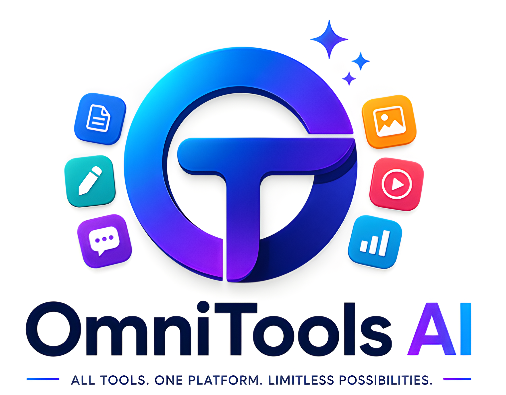

<p align="center">
  
</p>

# OmniTools AI — Offline Multi-Tool AI SaaS Platform

<p align="center">
  
  
  
  
  
  
  
</p>

<p align="center">
  <b>ALL TOOLS. ONE PLATFORM. LIMITLESS POSSIBILITIES.</b><br><br>
  A free, fully offline AI-powered multi-tool platform.<br>
  No internet required. No subscription. No limits.
</p>

---

## ✨ What is OmniTools AI?

**OmniTools AI** is a free, open-source, fully offline AI SaaS platform that brings professional-grade AI tools to your local machine. From image upscaling and watermark removal to video editing and PDF management — everything runs 100% on your own computer with no cloud uploads, no fees, and no limits.

---

## 🛠️ Tools Available

### 🖼️ Image Tools

| Tool | Technology | Description |
|------|-----------|-------------|
| 🔍 **Image Upscaler** | RealESRGAN | Upscale images up to 4x with AI super-resolution |
| 🚫 **Watermark Remover** | AI Inpainting | Remove watermarks from images automatically |
| 🧹 **Object Remover & Eraser** | AI Inpainting | Remove unwanted objects from images cleanly |

---

### 🎬 Video Tools

| Tool | Technology | Description |
|------|-----------|-------------|
| 🚫 **Video Watermark Remover** | AI + FFmpeg | Remove watermarks from video files |
| 🎭 **Video Object Remover** | AI + FFmpeg | Erase objects from video frames |
| 🎵 **Video to MP3 Converter** | FFmpeg | Extract audio from any video format |
| ✂️ **Video Trim & Timeline Cutter** | FFmpeg | Cut and trim videos with precision |

---

### 📄 Document Tools

| Tool | Description |
|------|-------------|
| 📊 **CSV to JSON Converter** | Convert CSV files to JSON format instantly |
| 📝 **PDF Editor** | Edit, merge, split, and modify PDF files |
| 📖 **PDF to EPUB Converter** | Convert PDF documents to EPUB ebook format |

---

### 🤖 Free LLM Download

Download and run free local AI language models directly from OmniTools AI — no API key needed, completely offline.

---

## 🛠️ Tech Stack

| Layer | Technology |
|-------|-----------|
| Frontend | HTML, CSS, JavaScript |
| Backend | Python, Flask/FastAPI |
| Image AI | RealESRGAN |
| Video Processing | FFmpeg |
| LLM Engine | Local LLM (offline) |
| Watermark/Object Removal | AI Inpainting |

---

## 📦 Requirements — Install These First

### 1. 🐍 Python (v3.10 or higher)
> Required to run the AI backend.

👉 [**Download Python**](https://www.python.org/downloads/) — Check **"Add to PATH"** during install!

### 2. 🎬 FFmpeg
> Required for all video processing tools.

👉 [**Download FFmpeg**](https://ffmpeg.org/download.html) — Follow the installation guide for your OS

### 3. 💻 VS Code (Recommended)
> Best editor for running and modifying the project.

👉 [**Download VS Code**](https://code.visualstudio.com/download)

### 4. 🟢 Node.js (Optional — for frontend dev server)
👉 [**Download Node.js**](https://nodejs.org/en/download) — LTS version

---

## 🚀 How to Run Locally

**Step 1** — Download the project:

Click the green **"Code"** button → **"Download ZIP"** → Extract the ZIP file

**Step 2** — Open in VS Code:

Open VS Code → **File** → **Open Folder** → Select the extracted folder

**Step 3** — Install Python dependencies:
```bash
cd backend
pip install -r requirements.txt
```

**Step 4** — Start the backend server:
```bash
python app.py
```

**Step 5** — Open the frontend:

Open `frontend/index.html` in your browser — or go to:
```
http://localhost:5000
```

🎉 All tools are now ready to use — 100% offline!

---

## 🤖 For Non-Coders — Easy Setup with VS Code AI

> **Don't know coding? No problem!**

1. Install **Python**, **FFmpeg**, and **VS Code** from the links above
2. Download the project ZIP → Extract → Open VS Code → Open the folder
3. Press **Ctrl + Shift + P** → type **"Chat"** → open AI assistant
4. Paste this prompt:

```
I downloaded OmniTools AI. Please help me:
1. Go to backend folder: cd backend
2. Install dependencies: pip install -r requirements.txt
3. Start the backend: python app.py
4. Open frontend/index.html in my browser
Do each step one by one and fix any errors.
```

---

## 📁 Project Structure

```
OmniTools-AI/
├── frontend/
│   ├── index.html              # Main UI
│   ├── api.html                # API documentation page
│   ├── style.css               # All styles
│   └── script.js               # Frontend logic
│
├── backend/
│   ├── app.py                  # Main Flask/FastAPI server
│   ├── llm_core.py             # Local LLM engine
│   └── tools/
│       ├── upscale.py          # RealESRGAN image upscaler
│       ├── watermark_remove.py # Watermark removal AI
│       ├── object_remove.py    # Object removal AI
│       ├── video_mp3.py        # Video to MP3 (FFmpeg)
│       └── video_trim.py       # Video trimmer (FFmpeg)
│
├── assets/
│   ├── logo.png                # OmniTools AI logo
│   └── CreateLLM.pdf           # LLM creation guide
│
├── requirements.txt            # Python dependencies
└── README.md                   # This file
```

---

## ⚙️ How It Works

```
Your File (Image / Video / Document)
              │
              ▼
       🌐 Frontend UI
    (index.html + script.js)
              │
              ▼
       🐍 Python Backend
          (app.py)
              │
    ┌─────────┴──────────┐
    │                    │
    ▼                    ▼
🖼️ Image Tools      🎬 Video Tools
RealESRGAN          FFmpeg
AI Inpainting       AI Processing
    │                    │
    └─────────┬──────────┘
              │
              ▼
       ✅ Processed Output
       (Download your file)
```

---

## 🔒 Privacy & Security

- ✅ **100% Offline** — No internet required after setup
- ✅ **No Cloud Upload** — Your files never leave your computer
- ✅ **No Account Required** — No signup, no tracking
- ✅ **No API Keys** — Everything runs locally

---

## ❓ FAQ

**Q: Is OmniTools AI really free?**
> Yes! 100% free and open source. No hidden costs, no subscription, no limits.

**Q: Do I need a GPU?**
> A GPU speeds up AI processing (especially RealESRGAN), but most tools work on CPU too. Results may be slower without a GPU.

**Q: What video formats are supported?**
> All major formats — MP4, MKV, AVI, MOV, WebM, and more (powered by FFmpeg).

**Q: Can I use this for commercial projects?**
> Yes! This project is MIT licensed. Check individual AI model licenses for commercial use.

**Q: How do I download free LLMs?**
> Open the app → go to the LLM section → choose your preferred model → click Download. The model runs fully offline.

---

## 📜 License

This project is licensed under the **MIT License** — free to use, share, and modify.

- RealESRGAN — BSD 3-Clause License
- FFmpeg — LGPL/GPL License

---

## 👨‍💻 Made by

**Preatom YT** — [@preatomytofficial](https://github.com/preatomytofficial)

> ⭐ If you like this project, please give it a **star** on GitHub!
